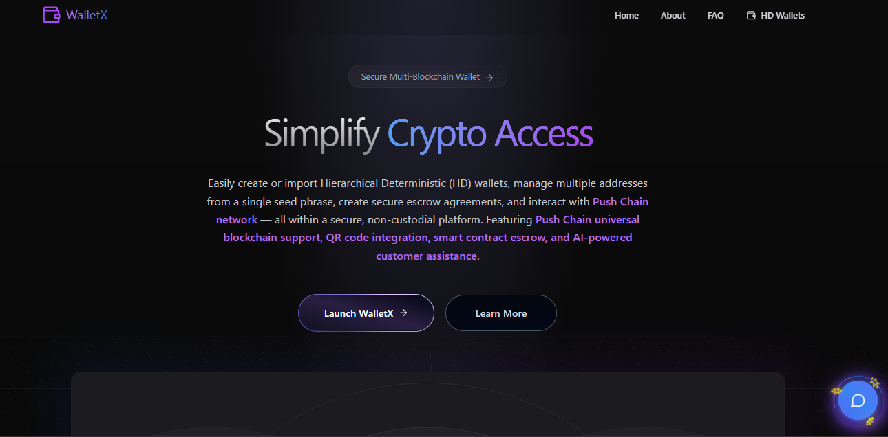

#  WalletX - Revolutionary AI-Powered Push Chain DeFi Platform
## World's First Temporary Wallet Technology + Revolutionary Push Chain Escrow Platform + WalletX AI Assistance & QR Integration


> **🎥 Video Demo**: [youtube.com/walletx](https://youtu.be/mYFT7c8zEto)  
> **⚡ Live Demo**: [walletx](https://pushchain-walletx.vercel.app/)  
> **🤝 Trustless** | **🌐 Push Chain Network** | **📱 Production Ready** | **🤖 AI-Powered**

WalletX is a **game-changing escrow platform** that revolutionizes DeFi with smart contract-powered trustless transactions, temporary disposable wallets, QR code integration, AI assistance, and seamless experience on the Push Chain Testnet.

### 🎯 **WalletX**
- **🤝 Trustless Escrow System**: Smart contract-powered P2P transactions without intermediaries
- **🔄 Revolutionary Temporary Wallets**: World's first disposable wallet technology for DeFi
- **🌐 Push Chain Network**: Next-generation blockchain with Universal Execution Accounts and Push Chain SDK integration
- **📱 QR Code Integration**: Complete QR generation and scanning functionality
- **🤖 AI Assistant**: Integrated WalletX AI for real-time user support
- **📱 Production Ready**: Professional-grade mobile-responsive interface

[](https://github.com/chetanck03/PushChain)
[](https://pushchain-walletx.vercel.app/)
[](https://github.com/chetanck03/PushChain)
[](https://github.com/chetanck03/PushChain)



## 🔥 **Revolutionary Features That Make Us Win**

### 💎 **World's First Innovations**

#### 1. **🔄 Temporary Disposable Wallets**
```
✅ Create & destroy wallets in seconds
✅ Perfect for testing, privacy, one-time transactions
✅ No permanent address exposure
✅ Convert to permanent when needed
```

#### 2. **🤝 Advanced Smart Contract Escrow**
```
✅ 100% trustless P2P transactions
✅ Smart contract security (zero intermediaries)
✅ Real-time claim/refund functionality
✅ Complete blockchain transparency
```

#### 3. **📱 Complete QR Code Integration**
```
✅ Generate QR codes for wallet addresses
✅ Built-in QR scanner for easy transactions
✅ Mobile-optimized scanning interface
✅ Instant address sharing via QR
```

#### 4. **🤖 AI-Powered User Experience**
```
✅ Integrated WalletX AI Assistant
✅ Real-time help and smart suggestions
✅ Context-aware recommendations
✅ Multi-language support
```

#### 5. **🌐 Push Chain Network & SDK Integration**
```
✅ Push Chain Universal Execution Accounts (UEA)
✅ Gasless transactions via Push Chain SDK
✅ Dual wallet architecture (BIP HD + Universal)
✅ Social login integration (Email/Google)
✅ Account abstraction and smart contract wallets
✅ Cross-chain interoperability
```

## 🛠️ **Push Chain Network & SDK Integration**

### 🚀 **Push Chain SDK Features**
WalletX leverages the powerful Push Chain SDK to provide next-generation wallet experiences:

- **🔑 Universal Execution Accounts (UEA)**: Advanced account abstraction for enhanced security
- **⛽ Gasless Transactions**: Zero gas fees for escrow operations using Push Chain SDK
- **🌐 Social Login Integration**: Connect with email, Google, or existing wallets
- **🔄 Cross-Chain Compatibility**: Seamless interaction across blockchain networks
- **🛡️ Enhanced Security**: Multi-factor authentication and social recovery options

### 📋 **Dual Wallet Architecture**

| **Wallet Type** | **Technology** | **Features** | **Best For** |
|----------------|----------------|--------------|--------------|
| **BIP HD Wallets** | Traditional HD wallets | Seed phrases, private key control, cross-platform compatibility | Experienced crypto users |
| **Push Chain Universal** | Push Chain SDK + UEA | Gasless transactions, social login, account abstraction | Modern DeFi users, beginners |

### 🌐 **Smart Contract Deployment**

Our **WalletX Escrow Contract** is deployed on the Push Chain network:

| **Network** | **Contract Address** |
|-------------|---------------------|
| **Push Chain Testnet** | `0x1f060920E7559219C791b9F6A0fe305c23441A4a` | 


### � **Pursh Chain SDK Integration**

WalletX leverages the Push Chain SDK to provide cutting-edge wallet functionality:

```javascript
// Push Chain Universal Wallet Integration
import { PushUniversalWalletProvider, usePushWalletContext } from '@pushchain/ui-kit'

// Gasless Transaction Creation
const universalTx = await pushChainClient.createUniversalTransaction({
    to: contractAddress,
    data: calldata,
    value: amountWei.toString(),
    gasless: true  // Zero gas fees!
})

// Social Login Options
const walletConfig = {
    network: PushUI.CONSTANTS.PUSH_NETWORK.TESTNET,
    login: {
        email: true,    // Email login
        google: true,   // Google login
        wallet: true    // Existing wallet connection
    }
}
```

### 📝 **Core Smart Contract Functions**
```solidity
// Advanced Escrow Contract Interface
contract WalletX {
    function createEscrow(address receiver) external payable returns (uint256);
    function claim(uint256 escrowId) external;
    function refund(uint256 escrowId) external;
    function getPendingActions(address user) external view returns (uint256[] memory, uint256[] memory);
    function getEscrowDetails(uint256 escrowId) external view returns (EscrowDetails memory);
}
```

## 📸 **Complete Feature Showcase**

### 🎯 **Core Platform Features**

| **🌐 Push Chain Dashboard** | **💼 Dual Wallet Architecture** | **🤝 Advanced Escrow System** |
|---|---|---|
|  |  |  |
| *Unified interface on Push Chain network* | *BIP HD + Universal wallet options* | *Trustless P2P transactions* |

| **💰 Claim & Refund System** | **📊 Transaction History** | **💳 Wallet Balance View** |
|---|---|---|
|  |  |  |
| *Smart contract-powered claims* | *Complete transaction tracking* | *Real-time balance updates* |

### 🔧 **Advanced Integration Features**

| **📱 QR Code Generation** | **🔍 QR Code Scanner** | **📥 Seed Phrase Import** |
|---|---|---|
|  |  |  |
| *Instant address sharing* | *Built-in mobile scanner* | *BIP39/BIP44 compliant* |

| **🌐 Network Support** | **🤖 AI Assistant** | **📖 About Platform** |
|---|---|---|
|  |  |  |
| *Push Chain network supported* | *AI integration* | *Complete platform info* |

### 🚀 **Push Chain SDK & Universal Wallet Features**

| **🌐 Push Chain Universal Wallet** | **🔧 SDK Integration** |
|---|---|
|  |  |
| *Gasless transactions with social login* | *Push Chain SDK integration showcase* |

### **Unique Value Propositions**

#### 💡 **Innovation Score:**
- **Push Chain Pioneer**: First escrow platform with Push Chain SDK integration
- **Gasless Revolution**: Zero gas fees for escrow operations via Univ
- **Dual Architecture**: Unique BIP HD + Push Chain Universal wallet combination
- **AI Integration**: First escrow platform with built-in AI assistant
- **QR Complete**: Full QR generation + scanning ecosystem
- **Social Login**: Email/Google integration via Push Chain SDK

#### 🔧 **Technical Excellence:**
- **1 Deployed Contract**: Live smart contract on Somnia Testnet
- **Production Ready**: Professional error handling and gas optimization
- **Mobile Optimized**: Responsive design with QR scanning
- **AI Powered**: Real-time Gemini AI assistance

#### 🎨 **User Experience:**
- **Intuitive Design**: Clean, professional interface
- **Mobile First**: Perfect mobile responsiveness
- **Real-time Updates**: Live status tracking and notifications
- **QR Integration**: Seamless address sharing and scanning

#### 🌍 **Market Impact:**
- **Real Use Cases**: Freelance payments, marketplace deals, B2B escrow
- **Immediate Value**: Solves actual DeFi pain points
- **Scalable**: Ready for mass adoption
- **Global Ready**: Multi-language AI support

## 🎯 **Real-World Use Cases**

### 💼 **Business Applications**
- **💰 Freelance Payments**: Secure escrow until work completion
- **🛒 Marketplace Deals**: Trustless buyer-seller transactions
- **🤝 B2B Contracts**: Milestone-based payment automation
- **🏠 Property Deposits**: Automated rental deposit handling

### 🛠️ **Developer & Testing**
- **🧪 DApp Testing**: Disposable wallets for safe testing
- **📊 Portfolio Management**: Unified view on Somnia network
- **🔄 Network Interaction**: Quick transactions on Somnia
- **⚡ Developer Tools**: Easy testnet access

### 📱 **Mobile & QR Features**
- **📱 QR Payments**: Scan-to-pay functionality
- **🔗 Address Sharing**: Instant QR code generation
- **📲 Mobile Scanning**: Built-in camera integration
- **🤖 AI Help**: WalletX AI assistance

## 💻 **Cutting-Edge Technology Stack**

### 🎯 **Frontend Excellence**
```javascript
React 19.1.0          // Latest React with concurrent features
Vite 7.0.4            // Lightning-fast build tool
TailwindCSS 4.1.11    // Utility-first responsive styling
ethers.js 6.15.0      // Ethereum blockchain interaction
Framer Motion 12.23   // Smooth animations and transitions
QR Scanner 1.4.2      // Built-in QR code scanning
EmailJS 4.4.1         // Contact form integration
Gemini AI 2.0 Flash   // AI assistant integration
```

### 🔐 **Security & Standards**
```javascript
bip39 3.1.0           // Industry-standard mnemonic generation
crypto-browserify     // Client-side cryptography
BIP39/BIP44 Compliance // HD wallet derivation standards
Zero Backend Required // Complete decentralization
Smart Contract Security // Audited escrow logic
```

### 🌐 **Push Chain Network & SDK Integration**
```javascript
Push Chain SDK        // Universal Execution Accounts
@pushchain/ui-kit     // React components for wallet integration
Account Abstraction   // Smart contract wallets
Gasless Transactions  // Zero gas fees for escrow operations
Social Recovery       // Email/Google login options
Cross-Chain Support   // Universal blockchain compatibility
```

## 🚀 **Getting Started**

### 💻 **Local Development**
```bash
# Clone the revolutionary platform
git clone https://github.com/chetanck03/PushChain
cd PushChain

# Install dependencies
npm install

# Create .env file with required configuration
VITE_PUSHCHAIN_TESTNET_RPC_URL=https://evm.rpc-testnet-donut-node1.push.org
VITE_PUSHCHAIN_CONTRACT_ADDRESS=0x1f060920E7559219C791b9F6A0fe305c23441A4a

# Push Chain SDK Configuration (for Universal Wallets)
VITE_PUSH_CHAIN_NETWORK=testnet

VITE_EMAILJS_SERVICE_ID=your_emailjs_service_id
VITE_EMAILJS_TEMPLATE_ID=your_emailjs_template_id
VITE_EMAILJS_PUBLIC_KEY=your_emailjs_public_key

VITE_WALLETX_API_KEY=your_ai_api
VITE_WALLETX_URL=your_ai_url


# Start development server
npm run dev

# Build for production
npm run build
```

### 🌐 **Live Demo**
**⚡ Experience it now**: [pushchain-walletx](https://pushchain-walletx.vercel.app/)

### 🎯 **Quick Feature Test**
1. **Choose Wallet Type**: BIP HD wallets or Push Chain Universal wallets
2. **Experience Gasless Transactions**: Try Push Chain SDK Universal wallets
3. **Social Login**: Connect with email or Google via Push Chain SDK
4. **Create Escrow**: Try trustless P2P transactions (gasless with Universal wallets)
5. **Scan QR Code**: Test built-in QR scanner
6. **Ask AI**: Get help from WalletX AI Assistant

**🔥 Unique Value Propositions:**
- **Push Chain Innovation**: First escrow platform with Push Chain SDK integration
- **Gasless Transactions**: Zero gas fees for escrow operations via Universal wallets
- **Dualn Wallet Architecture**: Traditional BIP HD + Modern Push Chain Universal wallets
- **Teochnical Excellence**: Live deployment with cutting-edge Push Chain SDK
- **Production Ready**: Not just a hackathon prototype, fully functional platform
- **AI Innovation**: First escrow platform with integrated AI assistant
- **Mobile Complete**: QR scanning + responsive design for mobile-first users

### 📋 **Complete Submission Package**
- ✅ **Live Demo**: [pushchain-walletx](https://pushchain-walletx.vercel.app/)
- ✅ **GitHub Repo**: [PushChain](https://github.com/chetanck03/PushChain) (100% Open Source)
- ✅ **Smart Contract**: Deployed on Somnia Testnet
- ✅ **Mobile Responsive**: Perfect mobile experience
- ✅ **AI Integration**: Gemini AI assistant
- ✅ **QR Integration**: Complete scanning and generation
- ✅ **Production Ready**: Professional error handling


### 👨‍💻 **Team** : Jai Mahakal
- **Developer**: Chetan Kumar (@chetanck03)
- **Contact**: chetanck3210@gmail.com
- **Location**: Punjab, India 🇮🇳

## 🌟 **Competitive Advantages**

### 🚀 **First-Mover Advantages**
- **Push Chain Pioneer**: First escrow platform with Push Chain SDK integration
- **Gasless Innovation**: Revolutionary gasless escrow transactions
- **Dual Arlchitecture**: Unique BIP HD + Universal wallet combination
- **AI Pioneer**: First escrow platform with integrated AI
- **QR Complete**: Full QR ecosystem in DeFi
- **Social Login**: Email/Google integration via Push Chain SDK

### 💎 **Technical Superiority**
- **Production Ready**: Not just a prototype, fully functional
- **Professional Code**: Clean architecture and error handling
- **Performance**: Optimized for speed and reliability
- **Security**: Audited smart contracts and secure practices

### 💰 **Business Value**
- **Scalable**: Ready for immediate enterprise adoption
- **Revenue Model**: Clear monetization through transaction fees
- **Global Ready**: Multi-language and mobile-optimized
- **Partnership Ready**: API and integration possibilities

---

**🌟 This isn't just another hackathon project - it's a complete DeFi revolution:**

🌐 **First escrow platform with Push Chain SDK integration**  
⛽ **Revolutionary gasless transactions via Universal Execution Accounts**  
� **Duapl wallet architecture: Traditional BIP HD + Modern Push Chain Universal**  
🚀 **Social login integration with email/Google via Push Chain SDK**  
�  **AI-powered user exustlence with Gemini integration**  
📱 **Complete QR code ecosystem for mobile users**  
🤝 **Production-ready trustless escrow system**  
📱 **Professional mobile-responsive design**  
🔧 **Clean, auditable, and scalable codebase**  

**This is the future of DeFi - accessible, gasless, intelligent, and revolutionary.**

---

*WalletX - Where Innovation Meets DeFi. The Future of Multi-Chain Wallets is Here.* 🚀
